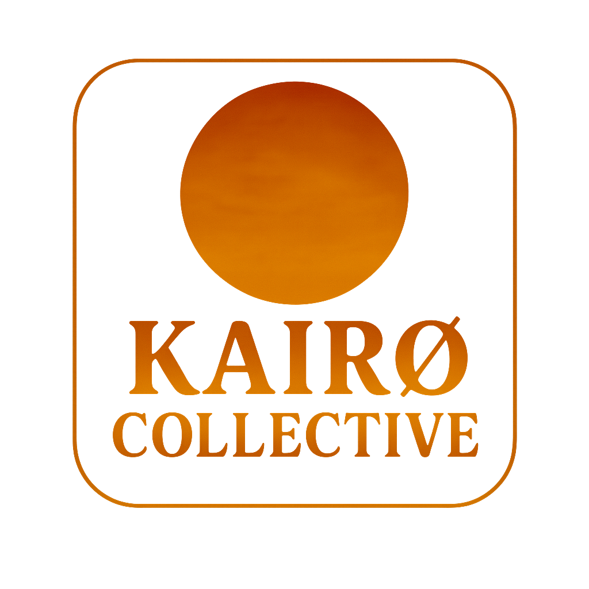

# MERN Starter Template

A professional boilerplate for MongoDB, Express, React + Vite (TypeScript), and Node.js. Beginner-friendly, production-ready, and branded for Kairo Collective. Real code, complete setup details, and creative, memorable energy.

## ✨ About Kairo Collective

Empowering creators and developers—where technology, cosmic art, and entrepreneurship come together.  
Built by [Carmen Wheeler](https://github.com/OutsideofemiT) for makers and makers-to-be.

## Project Structure

mern-starter/
  client/
    public/
      assets/
        KairoLogo.png
    src/
      components/
      App.tsx
      main.tsx
    package.json
    .env.example
  server/
    controllers/
      userController.js
    models/
      userModel.js
    routes/
      userRoutes.js
    server.js
    package.json
    .env.example
  .prettierrc
  LICENSE
  README.md
  .gitignore

## Getting Started

1. Prerequisites: Node.js v18+, npm, MongoDB (local or Atlas), Stripe account, Git.
2. Clone template:
   git clone https://github.com/YourUsername/mern-starter.git
   cd mern-starter
3. Install dependencies:
   cd client && npm install
   cd ../server && npm install

## Environment Variables

Copy `.env.example` to `.env` in each folder:

client/.env.example  
VITE_API_URL=http://localhost:5000/api  
VITE_STRIPE_PUBLIC_KEY=pk_test_XXXXXXXXXXXXXXXXXXXX  

server/.env.example  
PORT=5000  
DB_URI=mongodb://localhost:27017/mernstarter  
JWT_SECRET=your_jwt_secret  
STRIPE_SECRET_KEY=sk_test_XXXXXXXXXXXXXXXXXXXX  
CLIENT_URL=http://localhost:5173  

## Running the App

Start backend:  
cd server  
npm run dev  

Start frontend:  
cd ../client  
npm run dev  

## Backend Example Code

server/server.js  
const express = require('express');  
const mongoose = require('mongoose');  
const dotenv = require('dotenv');  
const cors = require('cors');  
const userRoutes = require('./routes/userRoutes');  

dotenv.config();  
const app = express();  

app.use(cors({ origin: process.env.CLIENT_URL, credentials: true }));  
app.use(express.json());  

app.use('/api/users', userRoutes);  
app.get('/api/hello', (req, res) => res.json({ message: 'Hello from backend!' }));  

const PORT = process.env.PORT || 5000;  
mongoose.connect(process.env.DB_URI)  
  .then(() => app.listen(PORT, () => console.log(`Server running on ${PORT}`)))  
  .catch(err => console.error('DB Error:', err));  

server/models/userModel.js  
const mongoose = require('mongoose');  
const userSchema = new mongoose.Schema({  
  name: { type: String, required: true },  
  email: { type: String, unique: true, required: true },  
  password: { type: String, required: true }  
}, { timestamps: true });  
module.exports = mongoose.model('User', userSchema);  

server/controllers/userController.js  
const User = require('../models/userModel');  
exports.getUsers = async (req, res) => {  
  const users = await User.find().select('-password');  
  res.json(users);  
};  

server/routes/userRoutes.js  
const express = require('express');  
const { getUsers } = require('../controllers/userController');  
const router = express.Router();  
router.get('/', getUsers);  
module.exports = router;  

Stripe payment example:  
const stripe = require('stripe')(process.env.STRIPE_SECRET_KEY);  
app.post('/api/pay', async (req, res) => {  
  try {  
    const { amount } = req.body;  
    const paymentIntent = await stripe.paymentIntents.create({  
      amount,  
      currency: 'usd'  
    });  
    res.send({ clientSecret: paymentIntent.client_secret });  
  } catch (err) {  
    res.status(500).send({ error: err.message });  
  }  
});  

## Frontend Example Code

client/src/App.tsx  
import React, { useEffect, useState } from 'react';  

function App() {  
  const [message, setMessage] = useState('');  
  useEffect(() => {  
    fetch(import.meta.env.VITE_API_URL + '/hello')  
      .then(res => res.json())  
      .then(data => setMessage(data.message))  
      .catch(() => setMessage('API error'));  
  }, []);  
  return (  
    
  
      <h1>MERN Starter</h1>  
      
Backend says: {message}
  
    
  
  );  
}  

export default App;  

## Linting, Formatting, Quality

- `.prettierrc` in root for all code.
- ESLint config in client and server.
- VS Code extensions: ESLint, Prettier recommended.
- Use `npm run lint`, `npm run format` in both folders.

## Troubleshooting

- npm install issues? Check node/npm version, delete node_modules, reinstall.
- MongoDB: Is it running? Or use Atlas URI.
- CORS: CLIENT_URL must match frontend.
- Stripe: Always use test keys for dev.
- API errors: Are both servers running, URLs matching?

## Resources

- Vite docs: https://vitejs.dev/guide/
- MongoDB Atlas: https://www.mongodb.com/cloud/atlas
- Express: https://expressjs.com/
- React: https://react.dev/
- Stripe API: https://stripe.com/docs/api

Clone, install, copy your .env, and get coding. This starter is styled and legit—from cosmic creators to pro developers!
